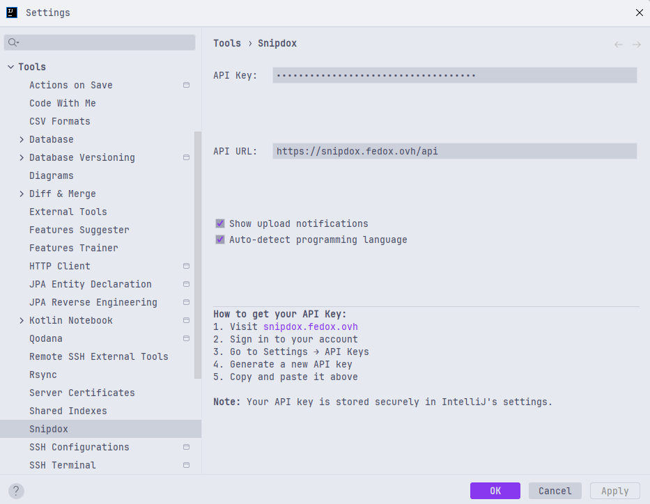
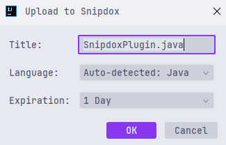

# Snipdox Uploader - IntelliJ IDEA Plugin

[](https://plugins.jetbrains.com/plugin/your-plugin-id)
[](https://plugins.jetbrains.com/plugin/27823)
[](https://plugins.jetbrains.com/plugin/27823)

Upload code snippets to [Snipdox](https://snipdox.fedox.ovh) directly from your IntelliJ IDEA editor with just a few
clicks.

## 🚀 Features

- **Quick Upload**: Select code and upload with right-click or keyboard shortcut
- **Auto Language Detection**: Automatically detects programming language from file context
- **Customizable Settings**: Configure API key, URL, and notification preferences
- **Multiple Expiration Options**: Set paste expiration (1 hour, 1 day, 1 week, 1 month, never)
- **Rich Notifications**: Get notified with direct links to your uploaded pastes
- **Keyboard Shortcuts**: Fast access with `Ctrl+Shift+S` (or `Cmd+Shift+S` on Mac)
- **Context Menu Integration**: Right-click on selected code to upload
- **Secure API Key Storage**: Your API key is stored securely in IntelliJ settings

## 📦 Installation

### From JetBrains Marketplace (Recommended)

1. Open IntelliJ IDEA
2. Go to `File` → `Settings` → `Plugins`
3. Click on `Marketplace` tab
4. Search for "Snipdox Uploader"
5. Click `Install` and restart IntelliJ IDEA

## ⚙️ Setup

### 1. Get Your API Key

1. Visit [snipdox.fedox.ovh](https://snipdox.fedox.ovh)
2. Sign in to your account (or create one)
3. Navigate to `Profile` → `API Key`
4. Generate a new API key
5. Copy the generated key

### 2. Configure the Plugin

1. Open IntelliJ IDEA Settings (`Ctrl+Alt+S` or `Cmd+,`)
2. Navigate to `Tools` → `Snipdox`
3. Enter your API key in the `API Key` field
4. Optionally configure other settings:
    - **API URL**: Default is `https://snipdox.fedox.ovh/api`
    - **Show Notifications**: Enable/disable upload notifications
    - **Auto-detect Language**: Automatically detect programming language



## 🎯 Usage

### Method 1: Context Menu

1. Select the code you want to upload
2. Right-click on the selection
3. Choose `Upload to Snipdox`
4. Configure title, language, and expiration in the dialog
5. Click `OK` to upload

### Method 2: Keyboard Shortcut

1. Select the code you want to upload
2. Press `Ctrl+Shift+S` (Windows/Linux) or `Cmd+Shift+S` (Mac)
3. Configure upload options in the dialog
4. Click `OK` to upload

### Method 3: Main Menu

1. Select the code you want to upload
2. Go to `Tools` → `Snipdox` → `Upload to Snipdox`
3. Configure upload options
4. Click `OK` to upload



## 🔧 Configuration Options

| Setting                  | Description                               | Default                         |
|--------------------------|-------------------------------------------|---------------------------------|
| **API Key**              | Your Snipdox API key (required)           | Empty                           |
| **API URL**              | Snipdox API endpoint                      | `https://snipdox.fedox.ovh/api` |
| **Show Notifications**   | Display upload success notifications      | `true`                          |
| **Auto-detect Language** | Automatically detect programming language | `true`                          |

## 🌐 Supported Languages

The plugin supports automatic language detection for:

- Java, Kotlin, Scala
- JavaScript, TypeScript
- Python
- C, C++, C#
- Go, Rust
- PHP, Ruby
- Swift, Dart
- HTML, CSS, SCSS, SASS
- SQL, JSON, XML, YAML
- Markdown
- Shell/Bash, PowerShell
- Dockerfile
- And many more...

## 🔒 Security & Privacy

- **API Key Security**: Your API key is stored securely using IntelliJ's credential storage system
- **HTTPS Only**: All communications with Snipdox servers use HTTPS encryption
- **No Data Collection**: The plugin doesn't collect or store any personal data
- **Local Processing**: Language detection and code processing happen locally

## 🛠️ Development

### Prerequisites

- IntelliJ IDEA 2024.3 or later
- Java 21 or later
- Gradle 8.0 or later

### Building from Source

```bash

# Clone the repository

git clone https://github.com/Fedox-die-Ente/snipdox-uploader.git
cd snipdox-uploader

# Build the plugin

./gradlew buildPlugin

# Run in development mode

./gradlew runIde
```

### Testing

```bash
# Run unit tests
./gradlew test

# Run integration tests
./gradlew integrationTest
```

## 🐛 Troubleshooting

### Common Issues

**"API key is required" error**

- Make sure you've configured your API key in the plugin settings
- Verify the API key is correct and active

**"Network error" when uploading**

- Check your internet connection
- Verify the API URL is correct
- Check if your firewall is blocking the connection

**Language not detected correctly**

- You can manually select the language in the upload dialog
- Make sure the file has the correct extension
- Check if auto-detection is enabled in settings

**Upload dialog doesn't appear**

- Make sure you have selected some code before trying to upload
- Check if the plugin is enabled in the plugins settings

### Getting Help

1. Search existing [Issues](https://github.com/Fedox-die-Ente/snipdox-uploader/issues)
3. Create a new issue with:
    - IntelliJ IDEA version
    - Plugin version
    - Steps to reproduce
    - Error messages (if any)

## 📄 License

This project is licensed under the MIT License - see the [LICENSE](LICENSE) file for details.

## 🙏 Acknowledgments

- [JetBrains](https://www.jetbrains.com/) for the excellent IntelliJ Platform
- [Snipdox](https://snipdox.fedox.ovh) for the paste service
- All contributors who help improve this plugin

## 📞 Support

- **Issues**: [GitHub Issues](https://github.com/Fedox-die-Ente/snipdox-uploader/issues)
- **Email**: f3dox@proton.me

---

<div align="center">
  <p>Made with ❤️ by <a href="https://github.com/Fedox-die-Ente">Fedox</a></p>
  <p>
    <a href="https://plugins.jetbrains.com/plugin/27823">JetBrains Marketplace</a> •
    <a href="https://github.com/Fedox-die-Ente/snipdox-uploader">GitHub</a> •
    <a href="https://snipdox.fedox.ovh">Snipdox</a>
  </p>
</div>
